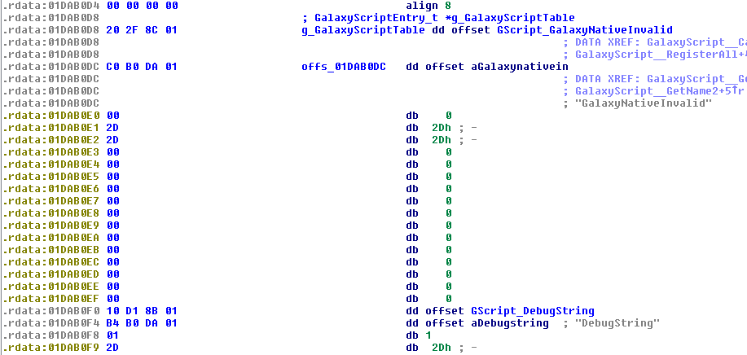
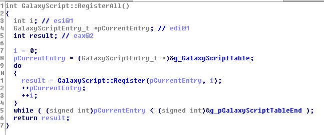
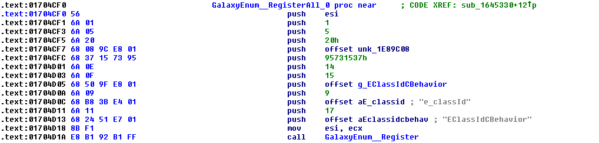

Dumping Heroes of the Storm GalaxyScript Enumerations & Functions.

---

*All content below is for educational purpose only*

<a href="{{ page.orig_link }}" target="_blank">Original link</a>

---

Before starting I would like to thanks [@athre0z](https://github.com/athre0z) for his great tool and source about HotS unpacking which made static analysis make easier instead of using a dump.

### Table of contents

- Preface
- Galaxy function registration
- Galaxy enumeration registration
- Dumping Galaxy functions
- Dumping Galaxy enumerations
- IDC Scripts
- Credits

## 1. Preface

Galaxy Script as (nearly ?) every scripting language in a game context need to link his function declaration against the native function of the game.
It is similar to Lua in WoW or WildStar, script functions names are statically embedded in the game executable.
In this post I'm gonna explain how to dump those functions & the according enums from the native registrations functions (not the registration & script <-> native function linking and calling). 

## 2. Galaxy function registration

At the beggining we need to reach the table which contains all the Galaxy functions about to be registered for the game.
You could search for any Galaxy script function name in order to reach it, let say "GalaxyNativeInvalid" which is in fact the first entry of the table but any function name would work but you'll have to search for the beggining.

You'll end up to something like this (some fields have been renamed) :


Looking at `GalaxyNativeInvalid` and `DebugString` we could guess the size of each entries in the registration table, which is 0x18 (1DAB0F0h - 1DAB0F0h).

I ended up with a structure for each entries :

```cpp
#pragma pack(push, 1)
struct __declspec(align(1)) GalaxyScriptEntry_t
{
  int (__thiscall *funcPtr)(void *this);
  const char *Name;
  BYTE nParameters;
  BYTE returnType;
  BYTE parametersType[14];
};
#pragma pack(pop)
```

Now, looking at the xref provided by IDA for the first field of the registration table we end up at a lone function :


We'll use this to parse the table and dump usefull informations in a next chapter.

## 3. Galaxy enumeration registration

Unlike Galaxy functions, Galaxy enums aren't stored in a lone table and not registered from a lone function but the function which actually register each enumeration is unique.
Like Galaxy functions, finding where is statically stored enums lead to this wanted function.

IDA output of code using those data : 


After analysing previous instruction before the call of "GalaxyEnum::Register" and the static data I was able to determine :

```cpp
struct GalaxyEnumEntry_t
{
  DWORD Value;
  const char *Name;
  DWORD NameLen;
};
```

```cpp
int __thiscall GalaxyEnum::Register(
    void *this, const char *Name, int nNameLen, const char *ShortName,
    int nShortNameLen, GalaxyEnumEntry_t *pEnumData, int nNumData,
    int nUnk, int nUnk_0, unsigned int pUnkData, int nNumUnkData, 
    int nUnk_1, int nUnk_2);
```

We'll use this in order to dump enums data.

## 4. Dumping Galaxy functions

Parsing the table is doing the job.

```cpp
auto curEntry = dwGScriptTableStart;
do
{
	curEntryFuncPtr = Dword(curEntry + 0);
	curEntryFuncName = GetString(Dword(curEntry + 4), -1, ASCSTR_C);
	dumpFunction(hFile, curEntryFuncPtr, curEntryFuncName);
	curEntry = curEntry + nGalaxyTableEntrySize;
}
while(curEntry < dwGScriptTableEnd);
```

## 5. Dumping Galaxy enumerations

It is more complicate here because you'll need to extract data from previous instructions before the call of `GalaxyEnum::Register` in order to dump the according static enum table.

Extracting data :

```cpp
auto head = PrevHead(dwAddress, 8);
	
//mov ecx, esi
//mov dword_xxxxxxxx, eax
while(GetMnem(head) == "mov")
	head = PrevHead(head, 8);
 
//push offset <EnumName>
if(GetMnem(head) == "push")
{
	szEnumName = GetString(GetOperandValue(head, 0), -1, ASCSTR_C);
}
else
{
	Message("Unexpected instruction at %x\n", head);
	return;
}
	
//push <name lenght>
head = PrevHead(head, 8);
if(GetMnem(head) != "push")
{
	Message("Unexpected instruction at %x\n", head);
	return;
}
 
//push offset <enumShortName>
head = PrevHead(head, 8);
if(GetMnem(head) == "push")
{
	szEnumShortName = GetString(GetOperandValue(head, 0), -1, ASCSTR_C);
}
else
{
	Message("Unexpected instruction at %x", head);
	return;
}
 
//push <short name lenght>
head = PrevHead(head, 8);
if(GetMnem(head) != "push")
{
	Message("Unexpected instruction at %x\n", head);
	return;
}
	
//push offset <enum data>
head = PrevHead(head, 8);
if(GetMnem(head) == "push")
{
	dwEnumDataAddress = GetOperandValue(head, 0);
}
else
{
	Message("Unexpected instruction at %x", head);
	return;
}
 
//push offset <enum data lenght>
head = PrevHead(head, 8);
if(GetMnem(head) == "push")
{
	nEnumData = GetOperandValue(head, 0);
}
else
{
	Message("Unexpected instruction at %x", head);
	return;
}
```

Dumping enum :

```cpp
for(i = 0; i < nDataLenght * 12; i = i + 12)
{
	dwFieldValue = Dword(dwData + i + 0);
	szFieldName = GetString(Dword(dwData + i + 4), -1, ASCSTR_C);
}
```

## 6. IDC Scripts

GalaxyScriptFunctionDumper.idc

```cpp
#include <idc.idc>
 
static ExtractPath( szPath )
{
	auto dwIndex;
	for ( dwIndex = strlen( szPath ); strstr( substr( szPath, dwIndex, -1 ), "/" ) && dwIndex > 0; dwIndex-- );
	return substr( szPath, 0, dwIndex + 1 );
}
 
static getGScriptTableStart()
{
	auto dwAddress;
	dwAddress = FindBinary(dwAddress + 1, SEARCH_DOWN|SEARCH_NEXT, "56 57 33 F6 BF ?? ?? ?? ?? 8D A4");
	
	return Dword(dwAddress + 5);
}
 
static getGScriptTableEnd()
{
	auto dwAddress;
	dwAddress = FindBinary(dwAddress + 1, SEARCH_DOWN|SEARCH_NEXT, "56 E8 ?? ?? ?? ?? 83 C7 ?? 46 81 FF ?? ?? ?? ??");
	
	return Dword(dwAddress + 12);
}
 
static dumpFunction( hFile, fnAddress, fnName )
{
	Message("ulebase + 0x%X] : %s\n", fnAddress - 0x800000, fnName);
	fprintf(hFile, "ulebase + 0x%x] : %s\n", fnAddress - 0x800000, fnName);
}
 
static main()
{
	Message("[Galaxy Script Function Dumper by Midi12]\n");
	
	auto hFile, szPath;
	szPath = ExtractPath(GetIdbPath()) + "GalaxyScript__FunctionDump.txt";
	hFile = fopen(szPath, "w");
 
	if(hFile == -1)
	{
		Message("Can't open dump file, aborting...");
		return;
	}
	
	fprintf(hFile, "[Galaxy Script Function Dumper by Midi12]\n");
	fprintf(hFile, "\n");
	
	auto dwGScriptTableStart = getGScriptTableStart();
	
	Message("GalaxyScriptTableStart : %x\n", dwGScriptTableStart);
 
	auto dwGScriptTableEnd = getGScriptTableEnd();
	
	Message("GalaxyScriptTableEnd : %x\n", dwGScriptTableEnd);
 
	auto nGalaxyTableEntrySize = 24;
	auto curEntry = dwGScriptTableStart;
	auto curEntryFuncPtr = 0;
	auto curEntryFuncName = 0;
 
	auto nFunction = 0;
	
	do
	{
		curEntryFuncPtr = Dword(curEntry + 0);
		curEntryFuncName = GetString(Dword(curEntry + 4), -1, ASCSTR_C);
		dumpFunction(hFile, curEntryFuncPtr, curEntryFuncName);
		curEntry = curEntry + nGalaxyTableEntrySize;
		nFunction = nFunction + 1;
	}
	while(curEntry < dwGScriptTableEnd);
 
	fprintf(hFile, "\n");
	fprintf(hFile, "[End of dump]");
	
	fclose(hFile);
	
	Message("Functions dumped = %d\n", nFunction);
	Message("Dump complete\n");
}
```

GalaxyScriptEnumDumper.idc

```cpp
#include <idc.idc>
 
static ExtractPath( szPath )
{
	auto dwIndex;
	for ( dwIndex = strlen( szPath ); strstr( substr( szPath, dwIndex, -1 ), "/" ) && dwIndex > 0; dwIndex-- );
	return substr( szPath, 0, dwIndex + 1 );
}
 
static IsAddrStartOfFunction( dwAddress )
{
	if(GetFunctionAttr(dwAddress, FUNCATTR_START) == dwAddress)
		return 1;
	return 0;
}
 
static getRegisterFunction()
{
	auto dwAddress;
	dwAddress = FindBinary(dwAddress + 1, SEARCH_DOWN|SEARCH_NEXT, "55 8B EC 83 EC ?? 56 57 6A ?? 8B F9 E8 ?? ?? ?? ?? 83 C4");
	
	if(IsAddrStartOfFunction(dwAddress) == 0)
		return -1;
	else
		return dwAddress;
}
 
static dumpEnumDataInternal(hFile, dwData, nDataLenght)
{
	auto dwFieldValue;
	auto szFieldName;
	
	auto i;
	for(i = 0; i < nDataLenght * 12; i = i + 12)
	{
		dwFieldValue = Dword(dwData + i + 0);
		szFieldName = GetString(Dword(dwData + i + 4), -1, ASCSTR_C);
		
		Message("\tFieldName = %s\n", szFieldName);
		Message("\tFieldValue = %d\n", dwFieldValue);
		
		fprintf(hFile, "\t%s = %d,\n", szFieldName, dwFieldValue);
	}
}
 
static dumpEnumFromAddress( hFile, dwAddress )
{
	auto szEnumName;
	auto szEnumShortName;
	auto dwEnumDataAddress;
	auto nEnumData;
	
	Message("entering dumpEnumFromAddress\n");
	auto head = PrevHead(dwAddress, 8);
	
	//mov ecx, esi
	//mov dword_xxxxxxxx, eax
	while(GetMnem(head) == "mov")
		head = PrevHead(head, 8);
	
	//push offset <EnumName>
	if(GetMnem(head) == "push")
	{
		szEnumName = GetString(GetOperandValue(head, 0), -1, ASCSTR_C);
	}
	else
	{
		Message("Unexpected instruction at %x\n", head);
		return;
	}
	
	//push <name lenght>
	head = PrevHead(head, 8);
	if(GetMnem(head) != "push")
	{
		Message("Unexpected instruction at %x\n", head);
		return;
	}
	
	//push offset <enumShortName>
	head = PrevHead(head, 8);
	if(GetMnem(head) == "push")
	{
		szEnumShortName = GetString(GetOperandValue(head, 0), -1, ASCSTR_C);
	}
	else
	{
		Message("Unexpected instruction at %x", head);
		return;
	}
	
	//push <short name lenght>
	head = PrevHead(head, 8);
	if(GetMnem(head) != "push")
	{
		Message("Unexpected instruction at %x\n", head);
		return;
	}
	
	//push offset <enum data>
	head = PrevHead(head, 8);
	if(GetMnem(head) == "push")
	{
		dwEnumDataAddress = GetOperandValue(head, 0);
	}
	else
	{
		Message("Unexpected instruction at %x", head);
		return;
	}
	
	//push offset <enum data lenght>
	head = PrevHead(head, 8);
	if(GetMnem(head) == "push")
	{
		nEnumData = GetOperandValue(head, 0);
	}
	else
	{
		Message("Unexpected instruction at %x", head);
		return;
	}
	
	Message("Name = %s\n", szEnumName);
	Message("ShortName = %s\n", szEnumShortName);
	Message("Enum Data ptr = %x\n", dwEnumDataAddress);
	Message("Enum Data len = %d\n", nEnumData);
	
	fprintf(hFile, "enum class %s //%s\n", szEnumName, szEnumShortName);
	fprintf(hFile, "{\n");
	
	dumpEnumDataInternal(hFile, dwEnumDataAddress, nEnumData);
	
	fprintf(hFile, "}\n\n");
	
	return;
}
 
static main()
{
	auto hFile, szPath;
	szPath = ExtractPath(GetIdbPath()) + "GalaxyScript__EnumDump.txt";
	hFile = fopen(szPath, "w");
	
	Message("[Galaxy Script Enum Dumper by Midi12]\n");
	
	if(hFile == -1)
	{
		Message("Can't open dump file, aborting ...");
		return;
	}
	
	fprintf(hFile, "[Galaxy Script Enum Dumper by Midi12]\n");
	fprintf(hFile, "\n");
	
	auto dwRegisterFunction = getRegisterFunction();
	
	if(dwRegisterFunction == -1)
	{
		Message("Can't find GalaxyEnum::Register() function, aborting ...");
		fclose(hFile);
		return;
	}
	
	auto dwAddress = 0;
	auto nEnums = 0;
	
	while(dwAddress != BADADDR)
	{
		dwAddress = RnextB(dwRegisterFunction, dwAddress);
		
		if(dwAddress == BADADDR)
			break;
		
		dumpEnumFromAddress(hFile, dwAddress);
		nEnums = nEnums + 1;
	}
	
	Message("Enums dumped : %d\n", nEnums);
	Message("Dump complete\n");
	
	fprintf(hFile, "\n");
	fprintf(hFile, "[End of dump]");
	
	fclose(hFile);
}
```

## 7. Credits

- athre0z (hots static unpacking source).
- crash_man7 (previous work on galaxy script for SC2, was able to complete my structure definition for Galaxy functions).
- everyone who helped & still helps during my journey of self-taught in reverse engineering.
