DGHack 2021 OSS v1.17 challenge in-depth analysis

---

The [DGHack](https://www.dghack.fr) CTF has been a nice experience and is a good challenge format for a solo player.

This was my first time-limited CTF.

I scored 67 out of 1047 contenders (global scoreboard) and 38 out of 427 contenders (professional scoreboard).

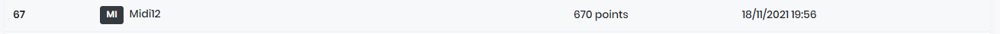
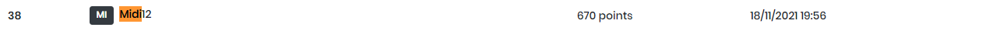

Update 02/02/2022: any thanks to [@JouetR](https://twitter.com/JouetR) for hosting me a remote instance, giving a chance to test my shellcode (and fix 'em) to grab the flags.

---

The OSS v1.17 challenge is rated from `easy` to `hard` difficulty.

> Ce challenge est un challenge à tiroir, à chaque étape vous pourrez valider un flag sous la forme DGA{XXX} dans l'étape correspondante.

Challenge link : [tcp://ossv117.chall.malicecyber.com:4993/](tcp://ossv117.chall.malicecyber.com:4993/)

Material : [dghack2021-ossv117-OS-S_v1.17.zip](../images/2022-1-2-OSSV1.17/dghack2021-ossv117-OS-S_v1.17.zip)

**Disclaimer: I did not succeed to finish this one in time, so I challenged myself to do it only through static analysis during this end of year holidays**

I will jump directly to the disk image analysis, however, you can read the readme in the archive to get a glance at the application.

TL; DR: Find 4 flags.

## Part 1: Master Boot Record

From the `file` command we assess that the QEmu image is a `MBR` (Master Boot Record) boot sector.

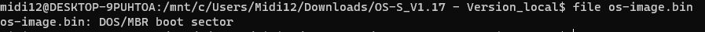

Now that we know this is an MBR boot sector, let's review the MBR.

The Master Boot Record is a piece of code loaded and executed by the BIOS before the Operating System. It is described by the following structure.

```c++
typedef struct _MASTER_BOOT_RECORD {
    std::uint8_t boot_code[0x1BE]; // boot code
    MBR_PARTITION_TABLE_ENTRY partition_table[4]; // main partitions table
    std::uint16_t mbr_signature; // magic, must be 0xAA55
} MASTER_BOOT_RECORD, *PMASTER_BOOT_RECORD;
```

We will only analyze the MBR in this part, let's extract it.

```python
MBR_SIZE = 512
IMAGE = 'os-image.bin'
MBR_FILE = 'mbr.bin'

def main():
    with open(IMAGE, 'rb') as src:
        with open(MBR_FILE, 'wb') as dst:
            dst.write(src.read(MBR_SIZE))

    print('extracted mbr from {} to {} ({} bytes)'.format(IMAGE, MBR_FILE, MBR_SIZE))


if __name__ == '__main__':
    main()
```

The MBR is always loaded by the BIOS at 0x7C00 and the BIOS runs in real mode (16 bit). In order to set up IDA to decode the MBR boot code properly, we will use these settings.

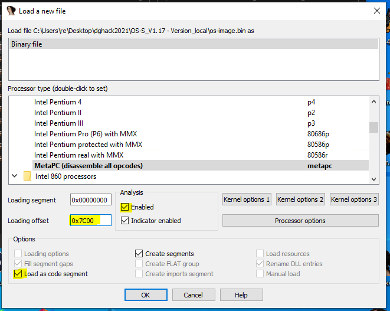

Then choose `No` to decode as 16-bit code.

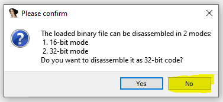

IDA will tell you it cannot find the entry point, when executed the boot code is executed from the first byte, the entry point is then at `7C00h`.

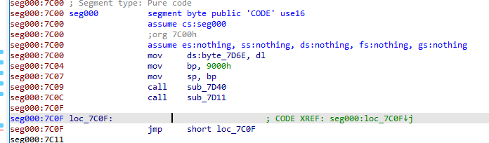

We can see that the stack frame (`bp` register) is set up at `0x7C04` and the stack pointer (`sp` register) is set up at `0x7C07`. The byte at `0x7D6E` holds the boot drive number, `dl` register is set to the number of the drive that was booted by the BIOS.

The subroutine `sub_7D40` move the value `0x1000` into `bx` register, the value `0x32` into `dh` register and call `sub_7C64`. This is important as those registers are used in `sub_7C64`.

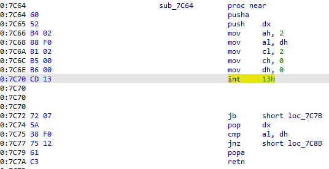

The subroutine `sub_7C64` set up the rest of the registers needed and uses a BIOS interrupt call (the number `20`). The `ah` register holds the function called by this interrupt: INT 13h with AH=02h is `Read Sectors From Drive`.

The `bx` register holds the destination buffer address pointer, the `al` holds the numbers of sectors to read, the `ch` register holds the cylinder number to read from, the `cl` register holds the sector number (so this is the second sector as it starts from `1`), the `dh` register holds the head number and the `dl` register holds the drive number.

The instruction will read 63 sectors to the buffer at address `0x1000`.
If the instruction does not fail, the two branches below the interrupt call won't be taken and the subroutine will return from `0x7C7A` to `0x7C07` (passing by `sub_7D40` of course). Fyi, the branches if taken lead to error printing to screen then an infinite loop.

The subroutine `sub_7D11` is the next to be called :

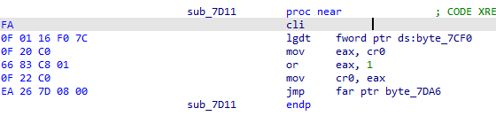

The subroutine clears the interrupt flag, loads the global descriptor table then changes the CPU mode from `real mode` to `protected mode`.

The instruction listing from `0x7D17` to `0x7D1E` fetches the control register `cr0` into eax, changes the bit `0` to `1` then assigns the `cr0` value back.

The instruction at `0x7D21` is a `far jump`, since we just changed from `real mode` to `protected mode` the CPU cache needs to be flushed, doing a far jump can do that. When following the far jump, we can notice it jumps to an area filled with zeroes (it jumps in the middle of the partition tables array of the MBR structure). The `0x7DA6` value is wrongly calculated as IDA uses the 16-bit formula (`(segment base << 4) + offset`).

When running in `protected mode` the addressing is a bit more complex. We need to analyze the `Global Descriptor Table` to compute the correct destination.

The `Global Descriptor Table pointer` address is `0x7CF0`, we will label it `s_gdt`.

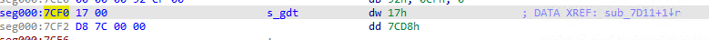

The GDT pointer structure layout is the following:

```c++
#pragma pack(push, 1)
typedef struct _GLOBAL_DESCRIPTOR_TABLE_PTR {
    std::uint16_t limit; // last entry - first entry - 1
    std::uint32_t base; // address of the first entry
} GLOBAL_DESCRIPTOR_TABLE_PTR, *PGLOBAL_DESCRIPTOR_TABLE_PTR;
#pragma pack(pop)
```

From the screenshot above, the location of the GDT is `0x7CD8`.

The GDT entry structure layout is the following:

```c++
#pragma pack(push, 1)
typedef struct _GDT_ENTRY {
    std::uint16_t limit_low;
    std::uint16_t base_low;
    std::uint8_t base_middle;
    std::uint8_t access;
    std::uint8_t granularity;
    std::uint8_t base_high;
} GDT_ENTRY, *PGDT_ENTRY;
#pragma pack(pop)
```

We can define those structures in IDA to get a nice output:

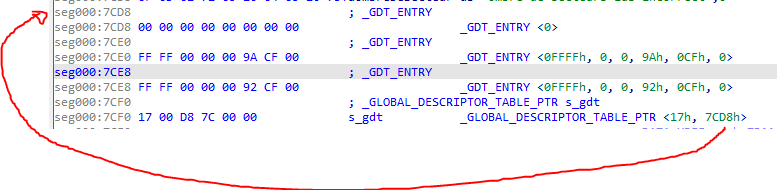

The assembly listing for the `far jmp` mentioned earlier is the following:
```x86asm
EA 26 7D 08 00                                jmp     far ptr byte_7DA6
```

The opcodes instruction can be decomposed as follow : 
```x86asm
EA  26 7D    08 00
op  offset   segment
             selector
```

The formula of the destination address in 32 bit without paging is `segment base + offset`, the segment base is given by the GDT entry. See the schema from [Intel® 64 and IA-32 Architectures Software Developer's Manuals](https://www.intel.com/content/www/us/en/developer/articles/technical/intel-sdm.html) below (don't take account of paging as it is relevant for our case):

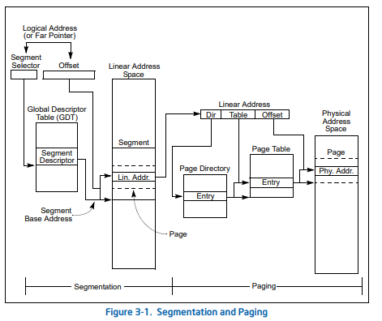

> If paging is not used, the linear address space of the processor is mapped directly into the physical address space
of the processor. The physical address space is defined as the range of addresses that the processor can generate on
its address bus.

Putting all the parts together:
```
segment base + offset -> gdt_entry.base + offset -> 0 + 0x7D26 -> 0x7D26
```

The destination address of the is `0x7D26`. From now we will be in 32 bit `protected mode`, the best way is to reopen the binary in 32-bit analysis using the same loading offset `0x7C00` and disabling analysis. Choose `yes` when IDA asks for 32-bit analysis.

Jump (`G` key) to `0x7D26`, ensure the cursor is placed at this address and reenable analysis.

The value `0x10` is placed into segment registers, then the stack frame and the stack pointer are set up. The subroutine `sub_7D4D` is then called.

The assembly listing for `sub_7D4D` is the following:

```x86asm
seg000:00007D4D sub_7D4D        proc near               ; CODE XREF: seg000:00007D3B↑p
seg000:00007D4D                 xor     edi, edi
seg000:00007D4F                 mov     ecx, 2000h
seg000:00007D54
seg000:00007D54 loc_7D54:                               ; CODE XREF: sub_7D4D+16↓j
seg000:00007D54                 and     edi, 3Fh
seg000:00007D57                 lea     eax, large ds:3000h
seg000:00007D5D                 sub     eax, ecx
seg000:00007D5F                 xor     [eax], di
seg000:00007D62                 inc     edi
seg000:00007D63                 loop    loc_7D54
seg000:00007D65                 jmp     short $+2
seg000:00007D67
seg000:00007D67 loc_7D67:                               ; CODE XREF: sub_7D4D+18↑j
seg000:00007D67                 call    near ptr 1000h
seg000:00007D6C
seg000:00007D6C loc_7D6C:                               ; CODE XREF: sub_7D4D:loc_7D6C↓j
seg000:00007D6C                 jmp     short loc_7D6C
seg000:00007D6C sub_7D4D        endp
```

The interesting part is the decryption routine just before the `absolute call` at `0x7D67`.

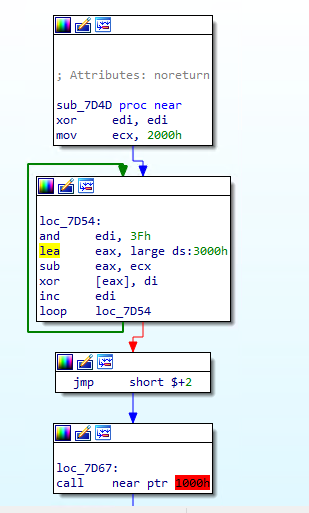

It is a simple xor based routine, not much to say:
```python
def decrypt(data):
    n = 0
    code = bytearray(data)

    for i in range(len(code)):
        k = n & 0x3f
        code[i] ^= k
        n = k + 1

    return code
```

If you remember, an `int 13h` interrupt is used early in the boot process to read 50 sectors into a buffer located at `0x1000`, the starting sector being the sector number `2` (starting from `1`) so the sector next to the MBR sector is the sector to start from.

In a raw image, the sectors are contiguous, the sector size is `512` bytes. Putting all the things together we can extract the remaining sectors to a file using the following python script:

```python
with open(IMAGE, 'rb') as src:
    src.seek(BLOCK_SIZE) # skip MBR
    with open(CODE_FILE, 'wb') as dst:
        dst.write(decrypt(src.read(BLOCK_SIZE * SECTORS)))
```

We can now load up the code into IDA to start stage 2 analysis (loading address `0x1000`).

*yay !*
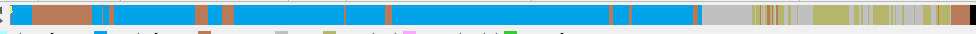

## Part 2: Gerboise Bleue

We can see the instruction at `0x1000` is a subroutine call, let's follow it.

```x86asm
seg000:0000154C                               sub_154C        proc near               ; CODE XREF: seg000:00001000↑p
seg000:0000154C 55                                            push    ebp
seg000:0000154D 89 E5                                         mov     ebp, esp
seg000:0000154F 83 EC 08                                      sub     esp, 8
seg000:00001552 E8 8A FD FF FF                                call    sub_12E1
seg000:00001557 E8 03 FE FF FF                                call    sub_135F
seg000:0000155C E8 E7 FE FF FF                                call    sub_1448
seg000:00001561 E8 6B FE FF FF                                call    sub_13D1
seg000:00001566
seg000:00001566                               loc_1566:                               ; CODE XREF: sub_154C+1F↓j
seg000:00001566 E8 A4 FF FF FF                                call    sub_150F
seg000:0000156B EB F9                                         jmp     short loc_1566
seg000:0000156B                               sub_154C        endp
```

The first three instructions are stack setup then 5 subroutines are called consecutively.

The first subroutine is calling 3 subroutines. The first one is setting up the `Interrupt Descriptor Table` and the second and third are writing to I/O ports through `sub_22A9` (will be named `write_port` from now on).

```x86asm
seg000:000022A9                               ; void __cdecl sub_22A9(unsigned __int16 a1, int a2)
seg000:000022A9                               sub_22A9        proc near               ; CODE XREF: sub_1891+E↑p
seg000:000022A9                                                                       ; sub_1891+30↑p ...
seg000:000022A9
seg000:000022A9                               a1              = word ptr  8
seg000:000022A9                               a2              = dword ptr  0Ch
seg000:000022A9
seg000:000022A9 55                                            push    ebp
seg000:000022AA 89 E5                                         mov     ebp, esp
seg000:000022AC 8B 55 08                                      mov     edx, dword ptr [ebp+a1]
seg000:000022AF 8B 45 0C                                      mov     eax, [ebp+a2]
seg000:000022B2 EE                                            out     dx, al
seg000:000022B3 5D                                            pop     ebp
seg000:000022B4 C3                                            retn
seg000:000022B4                               sub_22A9        endp
```

Listing the hardcoded ports with a Python script (`['0x20', '0x21', '0x43', '0xa0', '0xa1', '0x3d4', '0x3d5', '0x3f8', '0x3f9', '0x3fa', '0x3fb', '0x3fc']`) and looking ports online lead us near nowhere as `I/O ports` are platform specific and the documentation is scarse. I did not found a `QEMU` clear listing but digging through the source reveals `I/O ports` are implemented for `VGA`. Ports listed above are also for `PIC` (Programmable Interupt Controller).

This gives us a nicer image of `sub_12E1` which sole purpose is to initialize `IDT` and write to legacy ports.

Next subroutine called in `sub_154C` is `sub_135F`.

The subroutine `sub_135F` consecutively call `sub_1A31`, `sub_16FE` then `sub_1B85` multiple times.

The subroutine `sub_1A31` is writing data to the memory address `0xB8000` which is text screen video memory.

`sub_16FE` calls multiple subroutines that write to the text screen video memory address range, one, in particular, is interesting: `sub_1B20`.

```x86asm
seg000:00001745 018 68 58 29 00 00                                push    2958h
seg000:0000174A 01C E8 D9 03 00 00                                call    sub_1B28
```

It pushes the `0x2958` value which is in our code and data range and matches with the `DGHack !` string address.

Next subroutine called in `sub_154C` is `sub_1448`.
The first function called in `sub_1448` is `sub_1B85`.

Within this function, there is a function with a lot of xref: `sub_236F`. By looking at its assembly listing it is clear this subroutine is a `strlen`-like routine.

```x86asm
seg000:0000236F                                   ; int __cdecl strlen(int)
seg000:0000236F                                   strlen          proc near               ; CODE XREF: sub_1029+12↑p
seg000:0000236F                                                                           ; sub_133D+B↑p ...
seg000:0000236F
seg000:0000236F                                   arg_0           = dword ptr  8
seg000:0000236F
seg000:0000236F 000 55                                            push    ebp
seg000:00002370 004 31 C0                                         xor     eax, eax
seg000:00002372 004 89 E5                                         mov     ebp, esp
seg000:00002374 004 8B 55 08                                      mov     edx, [ebp+8]
seg000:00002377
seg000:00002377                                   loop:                                   ; CODE XREF: strlen+F↓j
seg000:00002377 004 80 3C 02 00                                   cmp     byte ptr [edx+eax], 0
seg000:0000237B 004 74 03                                         jz      short is_null_char
seg000:0000237D 004 40                                            inc     eax
seg000:0000237E 004 EB F7                                         jmp     short loop
seg000:00002380                                   ; ---------------------------------------------------------------------------
seg000:00002380
seg000:00002380                                   is_null_char:                           ; CODE XREF: strlen+C↑j
seg000:00002380 004 5D                                            pop     ebp
seg000:00002381 000 C3                                            retn
seg000:00002381                                   strlen          endp
```

This discovery enable us to find all string related functions :
- `sub_1029`
- `sub_133D`
- `sub_1B28`
- `sub_1B58`
- `sub_1B85`
- `sub_2382`
- `sub_23ED`
- `sub_2496`

After analysis of all the routines above, `sub_1029` is called inside `sub_1448` and is applying multiple bitwise operations such as `xor`, `rol` and `ror` on the input string (input is read by `sub_1CE0`). Another interesting subroutine is `sub_257C` which is an `strcmp` routine. The parameters are the transformed input string and `byte_2BE0`.

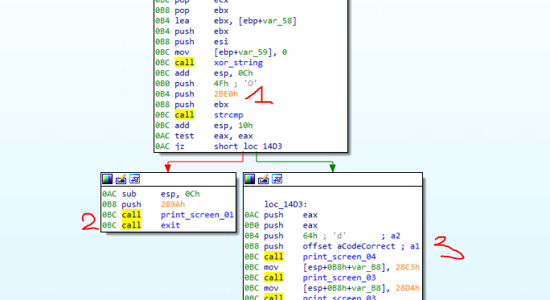

1. `strcmp(ebx, 0x2be0, 0x4f)`
2. if the string at the address stored in `ebx` and the string at `0x2be0` aren't the same (only the `0x4f` first characters) it prints an error message and exits using `halt` instruction.
3. if they are equal it prints the flag.

Let's write the invert of `sub_1029` (`xor_string` in the screenshot above) to recover the password.

```python
import idaapi

ENCRYPTED_PASSWORD_ADDR = 0x2BE0
LENGTH = 0x4F

# rol, ror : https://gyeongje.tistory.com/353

def rol(data, shift, size=8):
    shift %= size
    remains = data >> (size - shift)
    body = (data << shift) - (remains << size )
    return (body + remains)
     
 
def ror(data, shift, size=8):
    shift %= size
    body = data >> shift
    remains = (data << (size - shift)) - (body << size)
    return (body + remains)

def sub_1029_invert(src):
    dst = [] #bytearray(len(src))
    
    for i in range(len(src)):
        c = src[i]

        if i % 3 == 1:
            dst.append(rol(c, i) ^ dst[i - 1])
        else:
            if i % 3 == 2:
                dst.append(ror(c, dst[i - 1]) ^ dst[i - 1])
            else:
                dst.append(ror(c, i) ^ 0x42)

    return ''.join(chr(c) for c in dst)


def run():
    print('flag 1 password: {}'.format(sub_1029_invert(get_bytes(ENCRYPTED_PASSWORD_ADDR, LENGTH))))

if __name__ == '__main__':
    run()
```

Output of the script : `flag 1 password: Vous savez, moi je ne crois pas qu'il y ait de bon ou de mauvais mot de passe.`

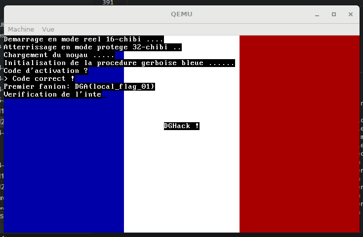

*(Nice use of VGA)*

The remote flag is `DGA{R0tat1on_d3_ch1bis}` 👍.

## Part 3: Vendor integrity

The next interesting function for getting the second flag is `sub_13D1`.
There is a subroutine `sub_1290` which contains 2 calls to the `cpuid` instruction.

```x86asm
seg000:00001290                                   ; BOOL cpuid_check()
seg000:00001290                                   cpuid_check     proc near               ; CODE XREF: flag_2+23↓p
seg000:00001290 000 31 C0                                         xor     eax, eax
seg000:00001292 000 0F A2                                         cpuid
seg000:00001294 000 81 FB 42 41 52 42                             cmp     ebx, 42524142h
seg000:0000129A 000 75 3B                                         jnz     short loc_12D7
seg000:0000129C 000 81 F9 4C 45 55 52                             cmp     ecx, 5255454Ch
seg000:000012A2 000 75 33                                         jnz     short loc_12D7
seg000:000012A4 000 81 FA 4F 55 49 4C                             cmp     edx, 4C49554Fh
seg000:000012AA 000 75 2B                                         jnz     short loc_12D7
seg000:000012AC 000 31 C0                                         xor     eax, eax
seg000:000012AE 000 40                                            inc     eax
seg000:000012AF 000 0F A2                                         cpuid
seg000:000012B1 000 3D 73 06 01 00                                cmp     eax, 10673h
seg000:000012B6 000 75 1F                                         jnz     short loc_12D7
seg000:000012B8 000 81 FB 00 08 00 00                             cmp     ebx, 800h
seg000:000012BE 000 75 17                                         jnz     short loc_12D7
seg000:000012C0 000 81 F9 00 20 88 82                             cmp     ecx, 82882000h
seg000:000012C6 000 75 0F                                         jnz     short loc_12D7
seg000:000012C8 000 81 FA FD E9 8B 07                             cmp     edx, 78BE9FDh
seg000:000012CE 000 75 07                                         jnz     short loc_12D7
seg000:000012D0 000 B8 01 00 00 00                                mov     eax, 1
seg000:000012D5 000 EB 05                                         jmp     short locret_12DC
seg000:000012D7                                   ; ---------------------------------------------------------------------------
seg000:000012D7
seg000:000012D7                                   loc_12D7:                               ; CODE XREF: cpuid_check+A↑j
seg000:000012D7                                                                           ; cpuid_check+12↑j ...
seg000:000012D7 000 B8 00 00 00 00                                mov     eax, 0
seg000:000012DC
seg000:000012DC                                   locret_12DC:                            ; CODE XREF: cpuid_check+45↑j
seg000:000012DC 000 C3                                            retn
seg000:000012DC                                   cpuid_check     endp
```

As we can see from the listing above, there is a `cpuid` call with `eax = 0` and another one with `eax = 1`.

From the `Table 3-8. Information Returned by CPUID Instruction` of Intel's instruction reference `cpuid eax = 0` will returns the cpu vendor name inside registers `ebx`, `ecx` and `edx`. With `eax = 1`, `cpuid` will returns version information (type, family, model, and stepping ID) in `eax`, feature informations in `ebx`, `ecx` and `edx`.

For `cpuid eax = 0`, `ebx` must equal `0x42524142`, `ecx` must equal `0x5255454C` and `edx` must equal `0x4C49554F`. Each values decodes to `'BRAB'`, `'RUEL'` and `'LIUO'`. So the vendor must equal `BARBOUILLEUR`.

For `cpuid eax = 1`, `eax` must equal `0x10673`, `ebx` must equal `0x800`, `ecx` must equal `0x82882000` and `edx` must equal `0x78BE9FD`. Each values translates as `0b10000011001110011`, `0b100000000000`, `0b10000010100010000010000000000000`, `0b111100010111110100111111101` in binary.

We know which bits to set for both checks. QEMU CPU can be configured using the `-cpu` switch.

The default CPU from the challenge `run.py` is `Westmere`. You can also only use `string.ascii_letters + string.digits + "," + "=" + '-' + '.'` characters which means you can only remove features off the CPU model. Since the `Westmere` CPU packs already a lot of features we will keep it and customize it.

From the [QEMU documentation](https://www.qemu.org/docs/master/system/qemu-cpu-models.html), you can set the `vendor` using `vendor=BARBOUILLEUR`.

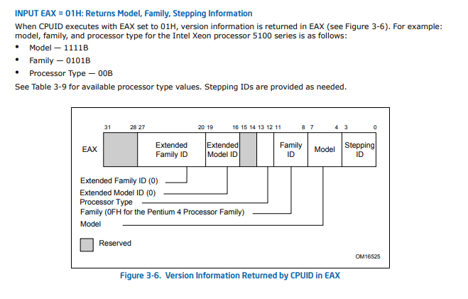

*(You can look up the bitmap for `cpuid eax=1` in the `Figure 3-6. Version Information Returned by CPUID in EAX` of Intel manual)*

From the expected `eax` value (`0b10000011001110011`) we can deduce we need `stepping=3` and `family=6`.

From the intel manual you can read this :
```
The Extended Model ID needs to be examined only when the Family ID is 06H or 0FH. Integrate the field into a
display using the following rule:

IF (Family_ID = 06H or Family_ID = 0FH)
    THEN DisplayModel = (Extended_Model_ID « 4) + Model_ID;
    (* Right justify and zero-extend 4-bit field; display Model_ID as HEX field.*)
    ELSE DisplayModel = Model_ID;
FI;
(* Show DisplayModel as HEX field. *)
```

Which means model must equal `(1 << 4) + 7` (`(extended_model_id << 4) + model_id`).

For the `eax` value check our cpu switch value is : `stepping=3,family=6,model=23`.

The `ebx` value does not seem to be customizable using qemu cpu switch. I choose to get back to it later if needed as only one bit is set.

The `ecx` value (`0b10000010100010000010000000000000`) can be mapped to the `Figure 3-7. Feature Information Returned in the ECX Register` in the Intel manual.

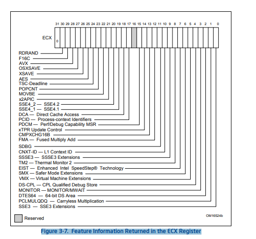

From the Westmere CPU architecture technical documentation we can assess the following properties :

* Major ISA features:
    - MMX
    - SSE
    - SSE2
    - SSE3
    - SSSE3
    - SSE41
    - SSE42

* The architecture brought new instruction on top of the Nehalem architecture like hardware-accelerated carry-less multiplication (`PCLMULQDQ`) and hardware-accelerated AES operations (`AES`).

So from the bit mapping and the gathered information, we can assume the Westmere architecture will have the necessary bits set.

The following features needs to be disabled for passing the `ecx` check:
`sse3`, `pclmulqdq`, `dtes64`, `monitor`, `ds-cpl`, `vmx`, `smx`, `tm2`, `ssse3`, `fma`, `xtpr`, `pdcm`, `pcid`, `dca`, `sse4.2`, `x2apic`, `movbe`, `tsc-deadline`, `xsave`, `avx`, `f16c`, `rdrand`.

We rinse and repeat for the `edx` check, the following features need to be disabled: `vme`, `apic`, `mtrr`, `ds`, `acpi`, `ss`, `tm`, `pbe`.

The final string for the cpu switch would be : `-cpu Westmere,vendor=BARBOUILLEUR,stepping=3,family=6,model=23,-sse3,-pclmulqdq,-dtes64,-monitor,-ds-cpl,-vmx,-smx,-tm2,-ssse3,-fma,-xtpr,-pdcm,-pcid,-dca,-sse4.2,-x2apic,-movbe,-tsc-deadline,-xsave,-avx,-f16c,-rdrand,-vme,-apic,-mtrr,-ds,-acpi,-ss,-tm,-pbe`.

(You can find all supported CPU flags by using this command: `qemu-system-x86_64 -cpu help`)

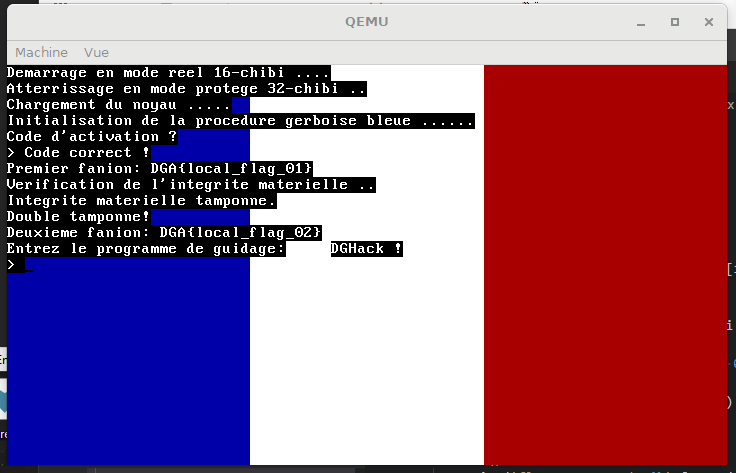

The second remote flag is `DGA{qemu_c_3st_qu4nd_m3m3_p4s_mal}`.

## Handwritten chibi

The next and last function called is `sub_150F`.

```x86asm
seg000:0000150F                                   ; int flag_3_4(void)
seg000:0000150F                                   flag_3_4        proc near               ; CODE XREF: sub_154C:loc_1566↓p
seg000:0000150F
seg000:0000150F                                   var_418         = dword ptr -418h
seg000:0000150F                                   var_408         = byte ptr -408h
seg000:0000150F                                   var_4           = dword ptr -4
seg000:0000150F
seg000:0000150F 000 55                                            push    ebp
seg000:00001510 004 89 E5                                         mov     ebp, esp
seg000:00001512 004 53                                            push    ebx
seg000:00001513 008 8D 9D F8 FB FF FF                             lea     ebx, [ebp+var_408]
seg000:00001519 008 81 EC 10 04 00 00                             sub     esp, 410h
seg000:0000151F 418 68 E7 28 00 00                                push    28E7h
seg000:00001524 41C E8 2F 06 00 00                                call    print_screen_03
seg000:00001529 41C C7 04 24 96 28 00 00                          mov     [esp+418h+var_418], 2896h
seg000:00001530 41C E8 23 06 00 00                                call    print_screen_03
seg000:00001535 41C 58                                            pop     eax
seg000:00001536 418 5A                                            pop     edx
seg000:00001537 414 68 00 04 00 00                                push    400h
seg000:0000153C 418 53                                            push    ebx
seg000:0000153D 41C E8 9E 07 00 00                                call    get_input
seg000:00001542 41C FF D3                                         call    ebx
seg000:00001544 41C 8B 5D FC                                      mov     ebx, [ebp+var_4]
seg000:00001547 41C 83 C4 10                                      add     esp, 10h
seg000:0000154A 40C C9                                            leave
seg000:0000154B 000 C3                                            retn
seg000:0000154B                                   flag_3_4        endp
```

As we can see there is a `call ebx` instruction at `0x1542`. It is immediately preceded by a call to the previously encountered subroutine `get_input`. Everything we write to stdin will be executed.

So, we have arbitrary code execution, we now need to craft a shellcode to get out the last 2 flags.

The third flag is laying inside the binary as we can see parts of it in the IDA string view.

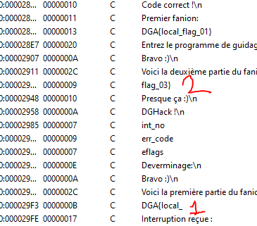

The first part is at `0x29F3` and the second `0x293D`. By using the `Search for immediate value` we are able to find where those values are referenced. It works because all strings are referenced by their absolute addresses.

- `0x293D` is used in `sub_156D`
- `0x29F3` is used in `sub_2170`

In `sub_2170` we can notice multiple checks before printing the first part of the flag.

But how to access this function? After following some xrefs I noticed `sub_2170` is called from `sub_10B0` which is the generic `Interrupt Service Routine` handler for the `IDT` which was set up just after the jump into protected mode.

In order to reach the first part of the flag, we need to forcefully call those handlers. This can be done using the `int n` (`0xCD`) instruction.

The first part is behind a check as we can see in the listing below the handler code must be equal to `0x10`.

```x86asm
seg000:0000217B 00C 83 F8 10                                      cmp     eax, 10h
seg000:0000217E 00C 74 25                                         jz      short loc_21A5
seg000:00002180 00C 77 12                                         ja      short loc_2194
```

The following payload can be written to show the first part.

```x86asm
int 0x10
ret
```

This translates to `\xcd\x10\xc3` in hexadecimal. Sending this crafted input to the program will call the 16th handler which will print the first part of the flag : `DGA{L3s_1nt3rupt1ons_`.

The second part is also behind a handler code check (`0x16`) but there are also other values on the stack that are checked. A `pusha` instruction in the beginning of the ISR handler code will push the values on the stack. The order is `ax`, `cx`, `dx`, `bx`, `sp`, `bp`, `si`, `di`.
We then just need to setup the right values in the right registers to get the second part of the flag.

```x86asm
mov eax, 0x2a
mov edi, 0x1337
int 0x16
ret
```

This translates to `\xb8\x2a\x00\x00\x00\xbf\x37\x13\x00\x00\xcd\x16\xc3` in hexadecimal. Sending this crafted input to the program will jump inside `sub_156D` which will print the second part of the flag : `c_3st_c00l}`.

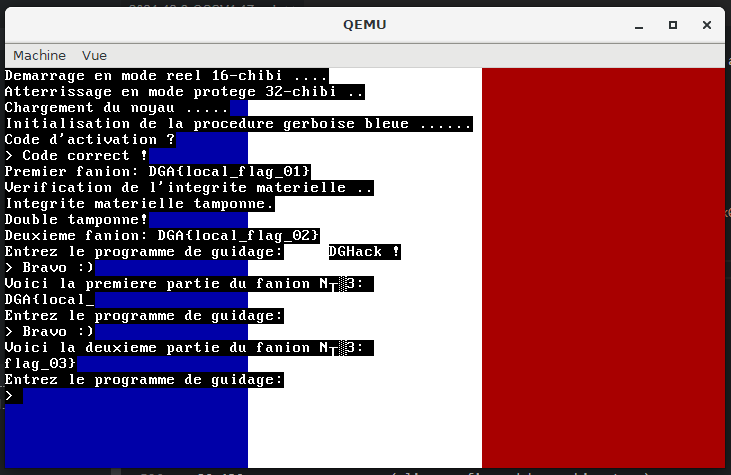

The third remote flags is `DGA{L3s_1nt3rupt1ons_c_3st_c00l}`.

## Port du masque obligatoire

The last flag is hiding in the `flag_04.txt`. the file is mounted as a hard drive using the `-hdb` switch.

The goal is to write a shellcode that read the hard disk content (the first sector) and output it to the VGA screen.

There is two possible paths (the ones I thought of) to achieve this :
- write a simplistic ATA driver to read the first sector and print it to the screen
- jump back to real mode, use the BIOS interrupts to read the first sector then print it to the screen

All the documentation needed to write an ATA driver to read hard disk can be found at [https://wiki.osdev.org/ATA_PIO_Mode](https://wiki.osdev.org/ATA_PIO_Mode) if you are interested.

The documentation to jump back to real mode can be found at [https://wiki.osdev.org/Real_Mode](https://wiki.osdev.org/Real_Mode).

I choose the first way and wrote it in C :

```C
// clang 13
// C
// -fPIC -O3 -m32

#include <sys/io.h>

#define BITCHK(v, p) \
    (v & (1 << p))

void __attribute__((always_inline)) __outb(unsigned short port, unsigned char value) {
    outb(value, port);
}

unsigned char __attribute__((always_inline)) __inb(unsigned short port) {
    return inb(port);
}

void flag4() {
    asm("pusha");

    unsigned int LBA = 0;
    
    // Send 0xE0 for the "master" or 0xF0 for the "slave", ORed with the highest 4 bits of the LBA to port 0x1F6
    int slavebit = 1;
    __outb(0x1F6, 0xE0 | (slavebit << 4) | ((LBA >> 24) & 0x0F));
    
    // Send a NULL byte to port 0x1F1, if you like (it is ignored and wastes lots of CPU time)
    __outb(0x1F1, 0x00);

    // Send the sectorcount to port 0x1F2:
    int sector_count = 1;
    __outb(0x1F2, sector_count);

    // Send the low 8 bits of the LBA to port 0x1F3
    __outb(0x1F3, LBA);

    // Send the next 8 bits of the LBA to port 0x1F4
    __outb(0x1F4, LBA >> 8);


    // Send the next 8 bits of the LBA to port 0x1F5
    __outb(0x1F5, LBA >> 16);


    // Send the "READ SECTORS" command (0x20) to port 0x1F7
    __outb(0x1F7, 0x20);


    // Wait for an IRQ or poll.
    int v = __inb(0x1F7);
    while (BITCHK(v, 7)) {
        v = __inb(0x1F7);
    }

    // Transfer 256 16-bit values, a uint16_t at a time, into your buffer from I/O port 0x1F0. (In assembler, REP INSW works well for this.)
    asm("mov $0x0100, %di");
    asm("mov $0x1f0, %dx");
    asm("mov $256,  %cx");
	asm("rep insw");

    // Send to serial port
    char *ptr = (char *)0x0100;
    while (*ptr != '\0') {
        while (!((__inb(0x3FD) & 0x20) != 0)) {}
        __outb(0x3F8, *ptr++);
    }

    asm("popa");
}
```

This is compiled with `clang -fPIC -O3 -m32 -c flag4.c`.

```x86asm
0:  60                      pusha
1:  b0 f0                   mov    al,0xf0
3:  66 ba f6 01             mov    dx,0x1f6
7:  ee                      out    dx,al
8:  31 c0                   xor    eax,eax
a:  66 ba f1 01             mov    dx,0x1f1
e:  ee                      out    dx,al
f:  b0 01                   mov    al,0x1
11: 66 ba f2 01             mov    dx,0x1f2
15: ee                      out    dx,al
16: 31 c0                   xor    eax,eax
18: 66 ba f3 01             mov    dx,0x1f3
1c: ee                      out    dx,al
1d: 31 c0                   xor    eax,eax
1f: 66 ba f4 01             mov    dx,0x1f4
23: ee                      out    dx,al
24: 31 c0                   xor    eax,eax
26: 66 ba f5 01             mov    dx,0x1f5
2a: ee                      out    dx,al
2b: b0 20                   mov    al,0x20
2d: 66 ba f7 01             mov    dx,0x1f7
31: ee                      out    dx,al
32: 66 ba f7 01             mov    dx,0x1f7
36: ec                      in     al,dx
37: 84 c0                   test   al,al
39: 79 0b                   jns    46 <read>
3b: 66 ba f7 01             mov    dx,0x1f7
3f: 66 90                   xchg   ax,ax
00000041 <poll>:
41: ec                      in     al,dx
42: 84 c0                   test   al,al
44: 78 fb                   js     41 <poll>
00000046 <read>:
46: 66 bf 00 01             mov    di,0x100
4a: 66 ba f0 01             mov    dx,0x1f0
4e: 66 b9 00 01             mov    cx,0x100
52: 66 f3 6d                rep ins WORD PTR es:[edi],dx
55: 80 3d 00 01 00 00 00    cmp    BYTE PTR ds:0x100,0x0
5c: 74 28                   je     86 <exit>
5e: b9 00 01 00 00          mov    ecx,0x100
63: 2e 66 0f 1f 04 00       nop    WORD PTR cs:[eax+eax*1]
69: 0f 1f 00                nop    DWORD PTR [eax]
0000006c <com1>:
6c: 66 ba fd 03             mov    dx,0x3fd
70: ec                      in     al,dx
71: a8 20                   test   al,0x20
73: 74 f7                   je     6c <com1>
75: 0f b6 01                movzx  eax,BYTE PTR [ecx]
78: 66 ba f8 03             mov    dx,0x3f8
7c: ee                      out    dx,al
7d: 80 79 01 00             cmp    BYTE PTR [ecx+0x1],0x0
81: 8d 49 01                lea    ecx,[ecx+0x1]
84: 75 e6                   jne    6c <com1>
00000086 <exit>:
86: 61                      popa
87: c3                      ret
```

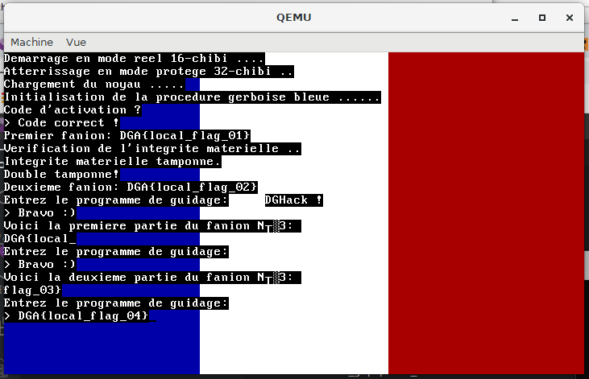

(The first iteration of my shellcode driver (is this a thing, "shellcode drivers" 😂 ?) was reusing `sub_1B58` to print to screen and serial).

The fourth flag is `DGA{Ma1t3n4nt_tu_A1mes_3crire_des_dR1v3rs}`.

## End words

I learned about the inner workings of boot sequences, real and protected mode as well as port I/O.

~~Unfortunately, the TCP server to grab the real flags is not available anymore 😖.~~

Again many thanks to [@JouetR](https://twitter.com/JouetR) for hosting me a remote instance to grab the flags and for the pointer about my initial way of getting the second flag not being perfect.